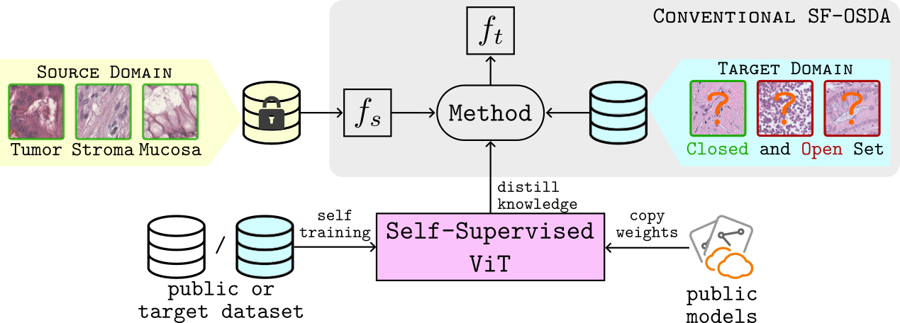

# Distill-SODA

This repository contains official [PyTorch](https://pytorch.org/) implementation for paper **Distill-SODA: Distilling Self-Supervised Vision Transformer for Source-Free Open-Set Domain Adaptation in Computational Pathology** by Guillaume Vray, Devavrat Tomar, Behzad Bozorgtabar, and Jean-Philippe Thiran.\
[[arxiv]](https://arxiv.org/abs/2307.04596)




## Table of Contents
- [Installation](#installation)
- [Usage](#usage)
- [Citation](#citation)
- [License](#license)


## Installation

Get started with this project by setting it up on your local machine. Follow these steps:

#### Clone the Repository
```bash
git clone git@github.com:LTS5/Distill-SODA.git
cd Distill-SODA
```

#### Install Dependencies
```bash
conda create --name DistillSODA python=3.8
conda activate SODA

pip install torch==1.13.0 torchvision==0.14.0 --extra-index-url https://download.pytorch.org/whl/cu113
conda install -c pytorch faiss-gpu cudatoolkit=11.3
pip install kornia==0.6.8
pip install tqdm
pip install pandas
pip install scikit-learn
```

## Usage

### Data Preparation

To reproduce our results, download the CRC tissue characterization datasets used in our work:

+ Kather-16:
```bash
# Download
wget https://zenodo.org/record/53169/files/Kather_texture_2016_image_tiles_5000.zip
unzip Kather_texture_2016_image_tiles_5000.zip -d data/Kather_texture_2016_image_tiles_5000

# Split
python data/kather2016.py --path_data_in data/Kather_texture_2016_image_tiles_5000           

# Clean
rm -r data/Kather_texture_2016_image_tiles_5000
rm Kather_texture_2016_image_tiles_5000.zip
```

+ Kather-19:
```bash
# Download
wget https://zenodo.org/record/1214456/files/NCT-CRC-HE-100K.zip
unzip NCT-CRC-HE-100K.zip -d data/

# Split
python data/kather100k.py --path_data_in data/NCT-CRC-HE-100K           

# Clean
rm -r data/NCT-CRC-HE-100K
rm NCT-CRC-HE-100K.zip
```

+ CRCTP:
```bash
# Download
wget https://warwick.ac.uk/fac/cross_fac/tia/data/crc-tp/fold2.zip
7z x fold2.zip && rm fold2.zip
mv Fold2 data/CRCTP

# Split
python data/crctp.py --path_data_in Fold2/Training/

# Clean
rm -r data/Fold2
rm fold2.zip
```

### Source Models

Download our source models following the google drive links below:

| Dataset | Open-Set Detection Method | Backbone | Download |
| --------|---------------------------|--------------|----------|
|Kather-16| CE+ | MobileNet-V2 | [ckpt](https://drive.google.com/drive/folders/1wApBoYhNW0V5mSjpfBVMNdZCzyU3hRPe?usp=drive_link) |
|Kather-19| CE+ | MobileNet-V2 | [ckpt](https://drive.google.com/drive/folders/1bghiqoZV9M4WVpD-ff-S-LEaGNHPUe6L?usp=drive_link) |
|CRCTP    | CE+ | MobileNet-V2 | [ckpt](https://drive.google.com/drive/folders/1eoJKl9cKC_s1-nqRH4ejCsgHT4Z588rk?usp=drive_link) |

If you wish to re-train or train models on your source dataset, use the [T3PO repo](https://github.com/agaldran/t3po) following their instructions.

### Distill-SODA

Adapt the source model on the target data by distilling knowledge from a self-supervised ViT:

```bash
python main_distillsoda.py --data_path path/to/target_data \
        --experiment_dir path/to/saving_dir \
        --dataset_name dataset_name --split_idx split_idx --seed seed \
        --source_model_path /path/to/source_model \
        --sslvit_model_path /path/to/ssl_vit_model
```

Our method seamlessly integrates with popular public models, such as DINO (ViT-B/16). If you wish to leverage these models, you can easily copy the [weights](https://dl.fbaipublicfiles.com/dino/dino_vitbase16_pretrain/dino_vitbase16_pretrain_full_checkpoint.pth) to use them as a starting point for your experiments.


### Self-Train ViT on Target Data

In our work, we introduced DINO+AdvStyle, a novel style-based adversarial data augmentation. This technique serves as hard positives for self-training a ViT, leading to highly contextualized embeddings for the target dataset. The incorporation of DINO+AdvStyle significantly enhances the performance of Distill-SODA.
To leverage DINO+AdvStyle and self-train a pretrained ViT on the target dataset, run the following script:

```bash
python -m torch.distributed.launch --nproc_per_node=2 main_dinoadvstyle.py --arch vit_base --data_path path/to/target_data \
        --dataset_name dataset_name --output_dir path/to/saving_dir \
        --momentum_teacher 0.996 --warmup_epochs 0 --batch_size_per_gpu 16
```

This command initiates the self-training process, utilizing DINO+AdvStyle for robust and context-aware embeddings. The resulting pretrained ViT can be further employed in the Distill-SODA process, enhancing the adaptation on the target dataset.


To reproduce our results, you can find the checkpoints for the three utilized datasets below:

| Dataset | SSL Backbone | Download |
| --------|--------------|----------|
|Kather-16| ViT-B/16 | [ckpt](https://drive.google.com/drive/folders/1LS4MXO6BzaR1A31-1E8mzxFgAwwff4-B?usp=drive_link) |
|Kather-19| ViT-B/16 | [ckpt](https://drive.google.com/drive/folders/14Lpr_nJtsckxSwfZhTZF-UgJry-Aq8u4?usp=drive_link) |
|CRCTP    | ViT-B/16 | [ckpt](https://drive.google.com/drive/folders/11eXm09z876NBqgbfBNKyypVpBIn_b5FN?usp=drive_link) |


## Citation

```
@article{vray2023source,
  title={Source-Free Open-Set Domain Adaptation for Histopathological Images via Distilling Self-Supervised Vision Transformer},
  author={Vray, Guillaume and Tomar, Devavrat and Bozorgtabar, Behzad and Thiran, Jean-Philippe},
  journal={arXiv preprint arXiv:2307.04596},
  year={2023}
}
```

## License

<a rel="license" href="http://creativecommons.org/licenses/by-nc-nd/4.0/"></a><br />This work is licensed under a <a rel="license" href="http://creativecommons.org/licenses/by-nc-nd/4.0/">Creative Commons Attribution-NonCommercial-NoDerivatives 4.0 International License</a>.

